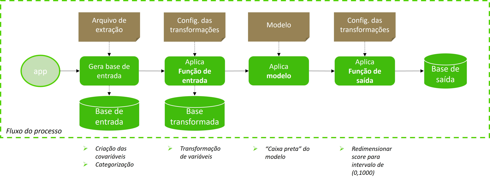

# Implementação - modelos


Diretório de implementação dos modelos proprietários da Farm.


## Visão Geral


O fluxo de implementação é dado por:




## Base de entrada


A base de entrada, selecionada via [query de extração](https://github.com/Farm-Investimentos/farm-ds-cspf/blob/4725f99b81437cc6d1a43f80aea4c07b61f8695c/query_extracao_base.sql), deve retornar os seguintes campos **obrigatórios**:

| Campo   | Tipo       | Descrição                           |
| :---------- | :--------- | :---------------------------------- |
| doc_raiz | string | Documento com 11 primeiros dígitos, se PF, e 8 primeiros dígitos, se PJ |
| id_model | string | ID da aplicação no modelo (chave única) |
| id_proposta | integer | ID da proposta (motor) |
| PF_PC_TPR01_IF_PF | double | Indicador Quod a respeito comprometimento futuro |
| PP_HA_AMP01_IF_PF | double | Indicador Quod a respeito de credores/contratos com dívidas em atraso |
| PP_PD_VPG01_IF_PF | double | Indicador Quod a respeito de pagamentos em dia |
| RM_BC_FRQ01_IF_PF | double | Indicador Quod a respeito de frequência de novos contratos |
| SCORE_HFIN | double | Score da Serasa |

A **base de entrada** é gerada pelo fluxo:


## Função de entrada


Arquivo com funções de entrada:

```python
funcao_entrada.py
```

Recebe um json com 2 argumentos


| Parâmetro   | Descrição                                   |
| :---------- |:------------------------------------------ |
| `data`      | **Obrigatório**. Dados de entrada, orientados em forma de **registros** (records) |
| `model`      | **Obrigatório**. Modelo a ser aplicado (Exemplo: "CSPF01") |

#### Aplicação das transformações

As transformações se encontram na pasta [functions](https://github.com/Farm-Investimentos/farm-ds-cspf/tree/main/functions), no arquivo:

```python
input_transf_v1.py
```

E são de dois tipos:

```python
def create_cat():
# Cria categorias das variáveis

def create_msg():
# Cria mengem do score
```

Ambas as funções podem ter configurações adicionais, importadas via **JSON** em arquivos de configurações, na pasta [functions/config](https://github.com/Farm-Investimentos/farm-ds-cspf/tree/main/functions/config). Para as funções de entrada, é o utilizado o arquivo **config_faixas_CSPF01.json**

O fluxo da **função de entrada** é:


## Base transformada


A base transformada, aplicadas as funções de entrada, deve retornar os seguintes campos **obrigatórios**:

| Campo   | Tipo       | Descrição                           |
| :---------- | :--------- | :---------------------------------- |
| doc_raiz | string | Documento com 11 primeiros dígitos, se PF, e 8 primeiros dígitos, se PJ |
| id_model | string | ID da aplicação no modelo (chave única) |
| id_proposta | integer | ID da proposta (motor) |
| SCORE_HFIN_faixas_[0,378] | integer | Coluna dummy indicando se o SCORE_HFIN esta entre 0 e 378 |
| SCORE_HFIN_faixas_(378,544] | integer | Coluna dummy indicando se o SCORE_HFIN esta entre 379 e 544 |
| SCORE_HFIN_faixas_(544,630] | integer | Coluna dummy indicando se o SCORE_HFIN esta entre 545 e 630 |
| SCORE_HFIN_faixas_(630,704] | integer | Coluna dummy indicando se o SCORE_HFIN esta entre 631 e 704 |
| SCORE_HFIN_faixas_(704,790] | integer | Coluna dummy indicando se o SCORE_HFIN esta entre 705 e 790 |
| SCORE_HFIN_faixas_(790,1000] | integer | Coluna dummy indicando se o SCORE_HFIN esta entre 791 e 1000 |
| PP_PD_VPG01_IF_PF_faixas_categoria_1 | integer | Coluna dummy indicando se o PP_PD_VPG01_IF_PF esta no intervalo [0, 70.01] |
PP_PD_VPG01_IF_PF_faixas_categoria_2 | integer | Coluna dummy indicando se o PP_PD_VPG01_IF_PF esta no intervalo [70.02, 100] |
PP_PD_VPG01_IF_PF_faixas_categoria_3 | integer | Coluna dummy indicando se o PP_PD_VPG01_IF_PF for 303 ou 304 |
PP_HA_AMP01_IF_PF_faixas_categoria_1 | integer | Coluna dummy indicando se o PP_HA_AMP01_IF_PF for 0 |
PP_HA_AMP01_IF_PF_faixas_categoria_2 | integer | Coluna dummy indicando se o PP_HA_AMP01_IF_PF esta no intervalo (0, 60], ou se for 303 ou 304 |
PP_HA_AMP01_IF_PF_faixas_categoria_3 | integer | Coluna dummy indicando se o PP_HA_AMP01_IF_PF esta no intervalo (60, 100] |
RM_BC_FRQ01_IF_PF_faixas_categoria_1 | integer | Coluna dummy indicando se o RM_BC_FRQ01_IF_PF for 0 ou 304|
RM_BC_FRQ01_IF_PF_faixas_categoria_2 | integer | Coluna dummy indicando se o RM_BC_FRQ01_IF_PF esta no intervalo (0, 32.15] |
RM_BC_FRQ01_IF_PF_faixas_categoria_3 | integer | Coluna dummy indicando se o RM_BC_FRQ01_IF_PF esta no intervalo (32.15, 87.01] |
RM_BC_FRQ01_IF_PF_faixas_categoria_4 | integer | Coluna dummy indicando se o RM_BC_FRQ01_IF_PF esta no intervalo (87.01, 100], ou se for 303 |
PF_PC_TPR01_IF_PF_faixas_categoria_1 | integer | Coluna dummy indicando se o PF_PC_TPR01_IF_PF esta no intervalo [0, 53.70], ou se for 303 |
PF_PC_TPR01_IF_PF_faixas_categoria_2 | integer | Coluna dummy indicando se o PF_PC_TPR01_IF_PF esta no intervalo (53.70, 80.05] |
PF_PC_TPR01_IF_PF_faixas_categoria_3 | integer | Coluna dummy indicando se o PF_PC_TPR01_IF_PF esta no intervalo (80.05, 100], ou se for 304 |


## Aplicação do modelo


Arquivo com a aplicação do modelo

```python
aplicacao_modelo.py
```

Recebe um json com 2 argumentos


| Parâmetro   | Descrição                                   |
| :---------- |:------------------------------------------ |
| `data`      | **Obrigatório**. Dados transformados, orientados em forma de **registros** (records) |
| `model`      | **Obrigatório**. Modelo a ser aplicado (Exemplo: "CSPF01") |
| `error_msg`      | **Obrigatório**. Mensagem de erro, reportada pela etapa anterior |

O modelo é aplicado através de um **pickle**, que se encontra na pasta [models](https://github.com/Farm-Investimentos/farm-ds-cspf/tree/main/models).

O fluxo de **aplicação do modelo** é dado por:


## Função de saída


Arquivo com funções de saída:

```python
funcao_saida.py
```

Recebe um json com 2 argumentos


| Parâmetro   | Descrição                                   |
| :---------- |:------------------------------------------ |
| `data`      | **Obrigatório**. Dados após a aplicação do modelo, orientados em forma de **registros** (records) |
| `model`      | **Obrigatório**. Modelo a ser aplicado (Exemplo: "CSPF01") |
| `error_msg`      | **Obrigatório**. Mensagem de erro, reportada pela etapa anterior |

#### Aplicação das transformações

As transformações se encontram na pasta [functions](https://github.com/Farm-Investimentos/farm-ds-cspf/tree/main/functions), no arquivo: 

```python
output_transf_v1.py
```

E são:

```python
def transform_v1():
# Função que traz o score final (em escala de 0 à 1000), para os scores calculados
```

A função pode ter configurações adicionais, importada via **JSON** em arquivos de configurações, na pasta [functions/config](https://github.com/Farm-Investimentos/farm-ds-cspf/tree/main/functions/config). Para as funções de saída, é  utilizado o arquivo **config_scores_CSPF01.json**

O fluxo da **função de saída** é:


## Base de saída


A base de saída deve retornar os seguintes campos **obrigatórios**:

| Campo   | Tipo       | Descrição                           |
| :---------- | :--------- | :---------------------------------- |
| model | string | Nome do modelo |
| prob_model | double | Probabilidade calculada pelo modelo |
| score | integer | Score final, na escala de 0 à 1000 |
| msg_score | string | Mensagem retornada pelo score (Serasa + Quod) |
| created_at | datetime | Data de criação |
| id_model | string | ID da aplicação do modelo (chave única) |
